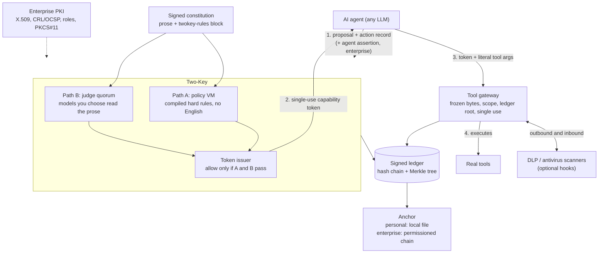

# Two-Key

[](https://github.com/Insomniac-VibeLabs/two-key/actions/workflows/tests.yml)

**Two independent keys must turn before an AI agent can act.** Two-Key is
an authorization layer for AI agents. A language model may *propose* an
action, but the action reaches a real tool only when a deterministic
policy check **and** an independent quorum of AI judges both approve it.
Approved actions get a short-lived, single-use capability token, and every
decision is written to a tamper-evident ledger signed with your key.

> **Status: prototype.** It has not had an independent security review and
> has not been deployed in production. Algorithms were chosen so a later
> build can run on a FIPS 140-3 validated module. **This release is not
> validated.** Read [Security model and
> limitations](#security-model-and-limitations) before relying on it.

## Contents

- [The problem](#the-problem)
- [Core concepts](#core-concepts)
- [Architecture](#architecture)
- [Install](#install)
- [Quickstart](#quickstart)
- [End-to-end demo](#end-to-end-demo)
- [Connecting judges](#connecting-judges)
- [Content scanners (DLP and antivirus)](#content-scanners-dlp-and-antivirus)
- [Enterprise setup](#enterprise-setup)
- [Configuration reference](#configuration-reference)
- [CLI reference](#cli-reference)
- [Best practices](#best-practices)
- [Troubleshooting](#troubleshooting)
- [FAQ](#faq)
- [Security model and limitations](#security-model-and-limitations)
- [Testing](#testing)
- [Contributing](#contributing)
- [Further documentation](#further-documentation)
- [License](#license)

## The problem

Agents that can send email, move money, or call APIs are only as safe as
the model driving them. Prompt injection, a confused model, or a vendor
change can turn "draft a reply" into "wire $4,800 offshore". Guardrails
inside the model, or a single LLM checking another LLM, can be talked out
of their rules.

Two-Key moves the decision outside the model. Neither key alone can open
the lock:

- **Path A** is a small deterministic virtual machine that runs your hard
  rules over a structured action record. It never reads English, so there
  is no prompt to inject.
- **Path B** is a quorum of AI judges, on providers you choose, that check
  the action against your plain-language constitution.

Only the tool gateway holds tool credentials, and it runs a tool only with
a valid token for exactly the arguments that were approved.

## Core concepts

| Concept | What it does | Details |
|---|---|---|
| **Constitution** | One document you write: plain-language prose plus a ```` ```twokey-rules ```` JSON block of hard rules. You sign it; anything unsigned, modified, or signed by another key (including a model vendor's) is refused. One signed source is compiled twice: rules to bytecode for Path A, prose to the judge prompt for Path B. Both hashes are recorded and bound into ballots and tokens | [HOWTO §3–4](docs/HOWTO.md) |
| **Path A: policy VM** | Compiled hard rules (`allow_only_tools`, `deny_if`, spend caps, blocked counterparties, …) run on a stack VM over fields such as `tool`, `amount_usd`, `counterparty`, `data_class`, `irreversible`. Any fault is a deny | [Rules](#constitution-rules-and-action-fields) |
| **Path B: judge quorum** | N judges (xAI, OpenAI-compatible, Anthropic, Gemini, Ollama, or any local server) return strict JSON ballots. Approval needs **T** yes votes after an availability floor **K**, with optional vendor-diversity and local-model floors. Malformed, late, or failed ballots abstain. They never count as yes | [Connecting judges](#connecting-judges) |
| **Both must agree** | A token is issued only when Path A **and** Path B pass. By default Path B isn't consulted after a Path A deny, so forbidden proposals never leave the machine | |
| **Capability token** | Short-lived (30 s default) and single-use. Bound to the tool, the exact argument bytes, the scope (amount, counterparty, data class), the ledger's Merkle root, and the constitution hashes. Signed by the principal key (`tk1-sig`) by default. HMAC (`tk1-hs384`) is only if chosen, and that verifier can also mint | |
| **Tool gateway (frozen bytes)** | The only component that runs tools. The call is serialized once into immutable bytes. Those bytes are hashed, checked against the token, scanned, and passed to the tool, so arguments can't change between check and use. It also checks scope, expiry, revocation, constitution reloads, single use (shared by every gateway on a ledger), and, via a Merkle consistency proof, that the token's ledger root is an ancestor of the current ledger | [HOWTO §9](docs/HOWTO.md) |
| **Signed Merkle ledger** | Every proposal, VM result, ballot, token, scan, and execution is appended to a JSONL hash chain with an RFC 9162 Merkle tree. The head is signed with your key, so rewriting, truncating, or unsigned appends are detected. Inclusion and consistency proofs are available | [HOWTO §12](docs/HOWTO.md) |
| **Anchoring and `deployment_mode`** | `personal` (default): the ledger stays local, optionally anchored to a local file. `enterprise`: every signed head is anchored to a permissioned chain (Hyperledger Fabric or a REST adapter), failing closed, PKI identities are required, and each decision is sent to a SIEM over syslog TLS (RFC 5424, port 6514). A down SIEM is recorded and does not change the decision. The mode is fixed once per ledger | [DEPLOYMENT_MODES.md](docs/DEPLOYMENT_MODES.md) |
| **DLP / AV scanning hooks** | Optional third-party scanners see the exact bytes leaving (outbound) and the tool results or files coming back (inbound). There are five hook types: vendor API, ICAP, in-process plugin, local sidecar, and async webhook. Any conviction denies; timeouts and errors block by default | [SCANNING_HOOKS.md](docs/SCANNING_HOOKS.md) |
| **Hybrid post-quantum crypto** | Ed25519, ECDSA P-384, and hybrid **ML-DSA-65** + Ed25519/P-384 (FIPS 204), where both halves must verify and downgrades are refused. Hashes are SHA-384 and HMAC-SHA-384. All crypto goes through one provider with an approved-algorithm list, `fips_mode`, and a known-answer self-test at startup | [CRYPTO.md](docs/CRYPTO.md) |
| **Seed-phrase backup** | Optional (personal mode): the key can be derived from a 24-word BIP-39 phrase plus an optional passphrase. Per-algorithm keys come from HKDF-SHA-384, and recovery and verification commands are included. Refused in `fips_mode` and in enterprise mode | [KEYS_AND_PKI.md §1](docs/KEYS_AND_PKI.md) |
| **PKI identities** | Enterprise: the principal, agents, and judges are X.509 identities. Two-Key checks the chain to your trust anchors, validity, key usage, and CRL/OCSP revocation, and maps the subject or SAN to roles. Agents sign a fresh, non-replayable assertion per request. Keys can live on PKCS#11 HSMs or smart cards. An ML-DSA-65 key is bound to the certificate by an extension | [KEYS_AND_PKI.md §2](docs/KEYS_AND_PKI.md) |

## Architecture

<!-- check: skip diagram, rendered by GitHub -->


More diagrams: [architecture](docs/figures/architecture.svg),
[authorize flow](docs/figures/authorize_flow.svg),
[token and gateway](docs/figures/token_gateway_sequence.svg),
[ledger](docs/figures/ledger_structure.svg),
[ledger-root-bound token](docs/figures/ledger_root_token.svg),
[one constitution, two compilations](docs/figures/two_compilations.svg),
[quorum protocol](docs/figures/quorum_protocol.svg)
([index](docs/figures/README.md)).

## Install

Requires Python ≥ 3.10. Two-Key is not on PyPI yet; install from a clone.
Every command in this README is run from the repository root and is
checked automatically by `tools/doccheck.py` (see [Testing](#testing)).

<!-- check: skip the checker runs in a copy of this repository instead of cloning it -->
```bash
git clone https://github.com/Insomniac-VibeLabs/two-key.git
cd two-key
```

<!-- check: expect=^OK -->
<!-- check: expect="ok": true -->
```bash
python3 -m venv .venv
. .venv/bin/activate
pip install -q -e ".[yaml,pq]"      # pq = cryptography>=50 for ML-DSA-65 (hybrid post-quantum)
python -m unittest discover -s tests 2>&1 | tail -1
python -m two_key selftest    # crypto known-answer self-test
```

| Extra | Installs | Needed for |
|---|---|---|
| (none) | `cryptography>=41` | Ed25519 / P-384, everything except ML-DSA |
| `yaml` | `pyyaml` | YAML judge and deployment config files |
| `pq` | `cryptography>=50` | ML-DSA-65 hybrid suites |
| `keyring` | `keyring` | API keys from the OS keyring |
| `liboqs` | `liboqs-python` | Alternative ML-DSA backend (not FIPS; refused in `fips_mode`) |
| `pip install python-pkcs11` | `python-pkcs11` | Keys on a PKCS#11 HSM or smart card (optional) |

## Quickstart

**1. Create your key.** The passphrase is read from an environment
variable, so it doesn't end up in your shell history.

<!-- check: expect=^fingerprint: -->
```bash
read -rsp "New key passphrase: " TWOKEY_KEY_PASSPHRASE; echo; export TWOKEY_KEY_PASSPHRASE
python -m two_key keygen --out ~/.two-key --passphrase-env TWOKEY_KEY_PASSPHRASE
```

This writes `~/.two-key/principal.pem` (private, mode 0600, encrypted)
and `principal.pub.pem`. For a post-quantum hybrid key add
`--suite hybrid-mldsa65-ed25519`. To get a 24-word backup phrase add
`--seed-phrase` ([HOWTO §2](docs/HOWTO.md#2-keys)).

**2. Write and sign your constitution.** Start from the example: Markdown
prose with exactly one ```` ```twokey-rules ```` JSON block holding the
hard rules.

<!-- check: expect=^OK: principal=did:twokey:alice -->
```bash
cp examples/constitution_single_source.md my-constitution.md     # then edit it
python -m two_key sign-constitution --document my-constitution.md \
    --principal did:twokey:alice --key ~/.two-key/principal.pem \
    --passphrase-env TWOKEY_KEY_PASSPHRASE --out my-constitution.signed.json
python -m two_key verify-constitution \
    --signed my-constitution.signed.json --pub ~/.two-key/principal.pub.pem
```

**3. Configure your judges.** `judges.yaml` names the environment
variables that hold your API keys; the keys never go in the file. Replace
each `<…>` with a model your account can use. For the local judge, the
recommended model is Qwen2.5-7B-Instruct (`qwen2.5:7b` in Ollama). The
weights are not in this repository. Setup is in
[Connecting judges](#recommended-local-judge-qwen25-7b-instruct) and
[HOWTO §5](docs/HOWTO.md#recommended-local-judge-qwen25-7b-instruct).

<!-- check: file=judges.yaml -->
```yaml
quorum:
  required_yes: 2        # T: yes votes needed
  min_responding: 2      # K: valid ballots needed before anything is counted
  timeout_seconds: 45    # judges run in parallel; late judges abstain
judges:
  - id: grok
    type: openai_compatible
    provider: xai
    base_url: https://api.x.ai/v1
    model: <xai-model-name>
    auth: {type: env, var: XAI_API_KEY}
  - id: claude
    type: anthropic
    provider: anthropic
    model: <anthropic-model-name>
    auth: {type: env, var: ANTHROPIC_API_KEY}
  - id: local
    type: ollama               # local weights via Ollama at http://localhost:11434, no key
    provider: local
    vendor: alibaba            # weight maker, for min_vendors; distinct from xAI and Anthropic
    model: qwen2.5:7b          # Qwen2.5-7B-Instruct; weights not in this repo
```

<!-- check: expect=^OK: 3 judges -->
```bash
python -m two_key check-judges --config judges.yaml    # validates only; no API calls
read -rsp "xAI API key: " XAI_API_KEY; echo; export XAI_API_KEY
read -rsp "Anthropic API key: " ANTHROPIC_API_KEY; echo; export ANTHROPIC_API_KEY
```

**4. Try the small offline demo** (test-double judges, temporary files, no
network):

<!-- check: expect=verify: ok -->
```bash
python -m two_key demo
```

**5. Put Two-Key between your agent and a tool.** First a small setup
module that the later examples reuse:

<!-- check: file=tk_setup.py -->
```python
"""tk_setup.py: build a TwoKey from the files created above."""
import os
from pathlib import Path

from two_key import keys
from two_key.constitution import load_envelope
from two_key.core import TwoKey
from two_key.judges.config import load_config_file

HOME = Path.home() / ".two-key"


def load_key():
    return keys.load_private_any(HOME / "principal.pem", os.environ["TWOKEY_KEY_PASSPHRASE"].encode())


def make_two_key(ledger="ledger.jsonl", **options):
    judges, quorum = load_config_file(Path("judges.yaml"))
    options.setdefault("quorum_policy", quorum)
    return TwoKey(load_envelope(Path("my-constitution.signed.json")),
                  keys.load_public_any(HOME / "principal.pub.pem"),
                  HOME / ledger, judges, ledger_signing_key=load_key(), **options)
```

<!-- check: file=my_agent.py -->
```python
from tk_setup import make_two_key


def pay_bill(payee, amount):          # your real tool; only the gateway calls it
    return f"paid {amount} to {payee}"


tk = make_two_key()
gateway = tk.gateway(tools={"pay_bill": pay_bill})
args = {"payee": "power-co.example", "amount": 42.5}           # the literal tool-call arguments
action = {"tool": "pay_bill", "amount_usd": 42.5, "counterparty": "power-co.example",
          "data_class": "financial", "irreversible": False}    # the normalized action record
decision = tk.authorize(action, "Pay the electric bill.", args)
print("decision:", decision.allowed, decision.reason, decision.quorum)
if decision.allowed:
    result = gateway.invoke(decision.capability, "pay_bill", args,
                            {"amount_usd": 42.5, "counterparty": "power-co.example",
                             "data_class": "financial"})
    print("gateway:", result.reason, result.result)
```

<!-- check: expect=^decision: True dual_path_pass -->
<!-- check: expect=^gateway: executed paid 42.5 to power-co.example -->
<!-- check: expect=^OK: ok \(entries=9\) -->
```bash
python my_agent.py
python -m two_key verify-ledger --ledger ~/.two-key/ledger.jsonl \
    --pub ~/.two-key/principal.pub.pem --key ~/.two-key/principal.pem \
    --passphrase-env TWOKEY_KEY_PASSPHRASE
```

Expected output with working judges (the quorum counts will vary):

```text
decision: True dual_path_pass {'yes': 3, 'no': 0, 'abstain': 0, 'reason': 'quorum_pass'}
gateway: executed paid 42.5 to power-co.example
OK: ok (entries=9)
```

If Ollama isn't running, or `qwen2.5:7b` has not been pulled, the local
judge abstains, and the other two still meet K = 2 and T = 2. A wire transfer, a payment over the $200 cap, or a
blocked counterparty is denied by Path A with the rule's id in
`decision.reason`, and the judges are never asked.

## End-to-end demo

`python -m two_key e2e-demo` exercises every capability offline in eight
sections (42 checks), with no vendor credentials. It uses test-double
judges, pattern scanners, a throwaway test CA, a software PKCS#11 token,
and an in-memory permissioned chain:

1. seed-phrase backup and recovery, plus the refusals in `fips_mode` and
   enterprise mode;
2. constitution upload and signing, and rejection of tampered or foreign
   signatures;
3. hybrid ML-DSA-65 + Ed25519 signatures, with either half missing
   refused;
4. Path A + Path B, both required, each able to deny on its own;
5. capability tokens and the gateway: single use, argument and tool
   binding, frozen bytes;
6. outbound and inbound DLP and antivirus scanning;
7. the ledger: hash chain, signed head, Merkle inclusion and consistency
   proofs, local anchoring, tamper detection;
8. enterprise: PKI identities, startup refusals, agent assertions with a
   PKCS#11 key, OCSP revocation, fail-closed revocation, permissioned-chain
   anchoring.

<!-- check: expect=^\[PASS\] both paths pass -> capability token issued -->
<!-- check: expect=^\[PASS\] frozen bytes: a mutation after checking never reaches the tool -->
<!-- check: expect=^e2e summary: \d+ passed, 0 failed, 0 skipped -->
```bash
python -m two_key e2e-demo
```

It exits non-zero if any check fails. Without an ML-DSA backend, the
hybrid section is reported as SKIP. `tests/test_e2e_demo.py` runs the demo
as part of the test suite.

## Connecting judges

Each entry under `judges:` in `judges.yaml` is one judge. Every adapter
sends your constitution's prose and the normalized action record, marked
as untrusted data, and accepts only a strict JSON ballot.

| `type` | Provider | Default `base_url` | Default auth header |
|---|---|---|---|
| `openai_compatible` | xAI, OpenAI, Together, vLLM, LM Studio, llama.cpp server, … | required | `bearer` |
| `anthropic` | Anthropic | `https://api.anthropic.com` | `x-api-key` |
| `gemini` | Google Gemini | `https://generativelanguage.googleapis.com` | `x-goog-api-key` |
| `ollama` | Local Ollama | `http://localhost:11434` | `none` |

Credentials (`auth:`) come from an environment variable (`env`), the OS
keyring (`keyring`), or your own SSO/OAuth code (`callback`). A secret
written in the file is refused. The `username_password` and
`oauth_device_code` modes are hook points that need your login function;
no vendor login is built in.

### Recommended local judge: Qwen2.5-7B-Instruct

The recommended local Path B judge is
[Qwen2.5-7B-Instruct](https://huggingface.co/Qwen/Qwen2.5-7B-Instruct)
(Apache-2.0, Copyright 2024 Alibaba Cloud). It is a suggestion, not a
requirement. Any model that returns the strict ballot works. This one is
the best fit for the ballot parser: Ollama's `format: json` plus
temperature 0, a system prompt it will hold when the action record tries
to override it, and a vendor other than xAI, Anthropic, or Google. A
malformed ballot abstains, so a model that misses the schema can fail a
quorum even when its judgment would have been right.

The weights are not in this repository. Point at them; do not commit them.
Q4 is about 4.7 GB. `qwen2.5:3b` is the smaller fallback. Below that, JSON
compliance drops and the judge mostly abstains. Skip Qwen3 thinking
variants here: a reasoning trace is extra text, and extra text is an
abstain.

<!-- check: skip needs a local Ollama install and a weight download; not part of the network-free check -->
```bash
# Install Ollama from https://ollama.com, then:
ollama pull qwen2.5:7b
ollama show qwen2.5:7b --modelfile    # optional: hash the GGUF and set weights_sha256
```

<!-- check: skip example only; the quickstart judges.yaml above is the checked copy -->
```yaml
- id: local-qwen
  type: ollama
  provider: local
  vendor: alibaba
  base_url: http://localhost:11434
  model: qwen2.5:7b
  local_weights: true          # default for ollama; counts toward min_local_judges
  # weights_sha256: <sha256 of the GGUF>   # recorded on the ballot, not verified
```

`examples/judges.yaml` uses the same model name. Full setup, including the
OpenAI-compatible path if you serve the Hugging Face weights with vLLM or
llama.cpp, is in
[HOWTO §5](docs/HOWTO.md#recommended-local-judge-qwen25-7b-instruct).

For a sturdier quorum, use at least three judges from at least two
vendors, one on local weights, and the stricter profile in Python:

<!-- check: expect=^min_vendors=2 min_local_judges=1 record_only True -->
```python
from two_key.quorum import QuorumPolicy

p = QuorumPolicy.section4(required_yes=2, min_responding=3)
print(f"min_vendors={p.min_vendors} min_local_judges={p.min_local_judges}", p.judge_inputs, p.require_path_a_first)
```

Every key is listed in the [configuration reference](#judgesyaml-quorum-section-quorumpolicy).
Per-provider walkthroughs are in [HOWTO §5–7](docs/HOWTO.md).

### Any judge, including Aeacus

Path B is whoever you list in `judges.yaml`. A cloud model, a local Ollama
model, another OpenAI-compatible server, and [Aeacus](https://github.com/sbusch305/Aeacus)
are the same kind of entry. Aeacus is optional. Leave it out and Two-Key
does not call it. Add it, alone or next to other judges, if you want a
local ballot that does not send the constitution to a vendor.

Both Path A and Path B still have to answer. Path B's answer is the quorum
you configured, not a particular model. If the judges you listed do not
produce a counted ballot, the action is denied.

<!-- check: skip optional Aeacus example; not loaded by the checker -->
```yaml
# optional; copy into judges.yaml or use examples/aeacus.yaml
- id: aeacus
  type: openai_compatible
  provider: aeacus-local
  base_url: http://127.0.0.1:8765/v1
  model: aeacus-micro-v1
  auth: {type: env, var: AEACUS_TOKEN}
  local_weights: true
  echo_binding: true
  allow_insecure_http: true
  ballot_key_env: AEACUS_TOKEN
  receives_proposal: true
```

Start Aeacus with `python -m aeacus serve` and the same `AEACUS_TOKEN`.
`examples/aeacus.yaml` is one profile that requires this local yes. It is
not the default. The default remains any local or cloud judge you choose.

A judge sees the proposal only if you annotate it with `receives_proposal: true`, or if the quorum uses `judge_inputs: record_and_proposal`. Any judge you annotate may receive it, local or cloud. A different model from the monitored agent is recommended, not required.

A cloud judge must not use the monitored agent's credential. Set `agent_session_env` to the environment variable that holds that credential. Two-Key reads it once at startup and denies the action if it equals a cloud judge's credential. There is no session argument on `authorize`. `X-Two-Key-Judge-Session` is Two-Key's own call id. It does not open a session at the provider. Do not write `ballot_key` in the file. Set `ballot_key_env` to an environment variable, the same way as an API key.

## Content scanners (DLP and antivirus)

Pass `scanners=[...]` to `tk.gateway()` to send outbound content (the
exact argument bytes, decoded strings, and attachments you extract) and
inbound content (tool results, returned files) to DLP or antivirus
software. With no scanners, the gateway behaves as before.

| Hook type | Class | Use for |
|---|---|---|
| Vendor API (REST or gRPC) | `VendorApiScanner` | Cloud DLP/AV APIs, mapped by a `ResponseMapping` |
| ICAP (RFC 3507) | `IcapScanner` | Proxy-style DLP/AV appliances (REQMOD out, RESPMOD in) |
| In-process plugin | `PatternScanner`, `ClamdScanner`, the plugin registry | Regex rules, ClamAV |
| Local sidecar | `SidecarScanner` | A daemon on a Unix socket or loopback (e.g. clamd INSTREAM) |
| Asynchronous | `AsyncCallbackScanner` + `WebhookReceiver` | Scanners that answer later through a webhook; holds until the verdict by default |

The example uses the built-in `PatternScanner` (an example plugin, not a
DLP product) against the files from the quickstart:

<!-- check: expect=^dlp, labelled public: scan_data_class_mismatch -->
<!-- check: expect=^av, EICAR attachment: scan_blocked:example-av -->
<!-- check: expect=^inbound, EICAR result: result_withheld:scan_blocked:example-av -->
```python
import base64
from two_key.scanning import EICAR, PatternRule, PatternScanner
from tk_setup import make_two_key

tk = make_two_key("scan-demo.jsonl")
dlp = PatternScanner("example-dlp", kind="dlp",
                     rules=[PatternRule("dx", rb"(?i)diagnosis", label="health", data_class="medical")])
av = PatternScanner("example-av", kind="av", rules=PatternScanner.example_rules())
fields = {"counterparty": "clinic.example", "data_class": "public"}


def token(args):
    return tk.authorize({"tool": "email_draft", "counterparty": "clinic.example", "data_class": "public",
                         "irreversible": False}, "Draft the note.", args).capability


note = {"to": "clinic.example", "body": "Diagnosis: example condition"}
gw = tk.gateway(tools={"email_draft": lambda to, body: "drafted"}, scanners=[dlp])
print("dlp, labelled public:", gw.invoke(token(note), "email_draft", note, fields).reason)

mail = {"to": "clinic.example", "body": "see attached", "attachment_b64": base64.b64encode(EICAR).decode()}
gw = tk.gateway(tools={"email_draft": lambda to, body, attachment_b64: "drafted"}, scanners=[av],
                file_extractors={"email_draft": lambda a: [("att", base64.b64decode(a["attachment_b64"]),
                                                            "application/octet-stream")]})
print("av, EICAR attachment:", gw.invoke(token(mail), "email_draft", mail, fields).reason)

gw = tk.gateway(tools={"email_draft": lambda to, body: EICAR}, scanners=[av])
plain = {"to": "clinic.example", "body": "hello"}
print("inbound, EICAR result:", gw.invoke(token(plain), "email_draft", plain, fields).reason)
```

`ScanSettings(timeout_seconds=10, on_timeout="block")` controls the wait
and what a timeout does. Scanner errors are logged and treated like
timeouts, scanners run in parallel, and any conviction denies. Every
verdict (scanner id and version, payload digest, outcome) is recorded in
the ledger. Details: [docs/SCANNING_HOOKS.md](docs/SCANNING_HOOKS.md).

## Enterprise setup

Enterprise mode is for organizations that want an auditable trail outside
any one machine and identities from their own PKI. It needs:

1. `deployment_mode="enterprise"` (argument, the `TWOKEY_DEPLOYMENT_MODE`
   environment variable, or `deployment_mode:` in a config file; all
   sources that are set must agree);
2. a **permissioned-chain anchor**: `FabricAnchor` (Hyperledger Fabric,
   through your gateway client or `FabricAnchor.from_fabric_sdk_py(...)`),
   `RestPermissionedAnchor` (any chain behind a JSON API), or your own
   `PermissionedLedgerAnchor` subclass. Every signed head is anchored, and
   an anchoring failure denies the action;
3. **PKI**: `pki=PkiConfig(...)` (or a `pki:` section in the config file)
   with your trust anchors, intermediates, CRLs and/or OCSP, and a
   `role_map`; plus the principal's certificate as `principal_credential`.
   Two-Key refuses to start without them;
4. **agent identities**: each `authorize` call carries an assertion that
   the agent signs with its certified key (`pki.sign_agent_request`), and
   that key can be on a PKCS#11 token (`pki.PythonPkcs11Token(module,
   token_label, pin)`).

A config file looks like this (paths are relative to the file):

<!-- check: skip needs your own CA files; the runnable example below builds the same setup in code -->
```yaml
deployment_mode: enterprise
pki:
  trust_anchors: [root-ca.pem]
  intermediates: [issuing-ca.pem]
  crls: [issuing-ca.crl, root-ca.crl]
  network_revocation: false      # true: fetch CRL DPs / query OCSP over HTTP
  revocation: ocsp_then_crl
  revocation_unreachable: fail_closed
  role_map:
    "email:alice@acme.example": [principal]
    "uri:spiffe://acme.example/agent/ops": [agent]
    "dns:judge-1.acme.example": [judge]
```

The runnable example below uses a throwaway test CA (`TestPki`), a fake
PKCS#11 token, and an in-memory Fabric stand-in, so it runs anywhere.
Replace them with your CA files, `PythonPkcs11Token`, and your Fabric
client:

<!-- check: expect=^refused: .*requires PKI identities -->
<!-- check: expect=^no assertion: agent_identity_required -->
<!-- check: expect=^certified agent: dual_path_pass -->
<!-- check: expect=^after revocation: agent_identity_rejected:revoked -->
<!-- check: expect=^anchored heads: ok -->
```python
from two_key import pki
from two_key.anchoring import FabricAnchor, check_anchored_entries
from two_key.core import TwoKeyConfigError
from two_key.e2e_demo import InMemoryFabric
from two_key.pki_testing import SoftwareToken, TestPki
from tk_setup import load_key, make_two_key

ca = TestPki()                                            # your CA in production
roles = {"email:alice@example.com": ["principal"], "uri:spiffe://example.com/agent/ops": ["agent"]}
cert, _ = ca.issue("Alice", email="alice@example.com", key=load_key())
anchor = FabricAnchor(InMemoryFabric(), channel="audit", chaincode="twokey-anchor")

try:
    make_two_key("enterprise.jsonl", deployment_mode="enterprise", anchor=anchor)
except TwoKeyConfigError as e:
    print("refused:", e)

tk = make_two_key("enterprise.jsonl", deployment_mode="enterprise", anchor=anchor,
                  pki=ca.config(roles, ocsp=True), principal_credential=ca.credential(cert))
token = SoftwareToken()                                   # stands in for an HSM or smart card
agent, agent_key = ca.identity("Ops Agent", uri="spiffe://example.com/agent/ops", key=token.generate("ops"))
action = {"tool": "search", "data_class": "public", "irreversible": False}

print("no assertion:", tk.authorize(action, "Search.", {}).reason)
signed = pki.sign_agent_request(agent, agent_key, action, "Search.", {})
print("certified agent:", tk.authorize(action, "Search.", {}, agent_assertion=signed).reason)
ca.revoke(agent.certificate)                              # the OCSP responder now answers "revoked"
signed = pki.sign_agent_request(agent, agent_key, action, "Search.", {})
print("after revocation:", tk.authorize(action, "Search.", {}, agent_assertion=signed).reason)
checks = check_anchored_entries(tk.ledger, load_key().public_key(), anchor)
print("anchored heads:", ", ".join(sorted({c.reason for c in checks})), f"({len(checks)})")
```

For real certificates, load them with `pki.Credential.from_pem(cert,
chain)` and the configuration with `PkiConfig.from_mapping(...)` or the
`pki:` file section. The checks, the ML-DSA-65 binding extension, and the
placeholder defaults are in [docs/KEYS_AND_PKI.md](docs/KEYS_AND_PKI.md).
The Fabric chaincode contract and receipt checks are in
[docs/DEPLOYMENT_MODES.md](docs/DEPLOYMENT_MODES.md).

## Configuration reference

Every option below is taken from the code (`two_key/`). Defaults are the
values used when the option is omitted.

### `judges.yaml`: `quorum:` section (`QuorumPolicy`)

Omitting the whole section gives `required_yes = min(2, number of judges)`
with every other key at its default.

| Key | Default | Allowed values | What it does |
|---|---|---|---|
| `required_yes` | `2` | integer ≥ 1, ≤ number of judges | **T**, the approval threshold: yes votes needed |
| `min_responding` | = `required_yes` | integer ≥ 1 | **K**, the availability floor: with fewer valid ballots the result is deny *without counting* (`counted: false`) |
| `min_distinct_providers` | `1` (off) | integer ≥ 1 | Distinct `provider` labels needed among valid ballots |
| `min_vendors` | `1` (off) | integer ≥ 1 | Distinct `vendor`s required in the judge set; Two-Key refuses to start below it |
| `min_local_judges` | `0` (off) | integer ≥ 0 | Judges with `local_weights: true` required in the judge set |
| `heterogeneity_scope` | `selection` | `selection`, `responding` | `responding` also applies the two floors above to the judges that returned valid ballots |
| `judge_inputs` | `record_only` | `record_only`, `record_and_proposal` | What judges see besides the prose: only the normalized action record, or also the proposal text |
| `ballot_binding` | `stamp` | `stamp`, `echo` | `echo`: every judge must echo H(action record) and H(constitution) (needs `echo_binding: true` on LLM judges) |
| `require_path_a_first` | `false` | boolean | Path A still runs first. It no longer skips Path B. |
| `timeout_seconds` | `45` | number > 0, or `null` (no deadline) | Overall deadline for all judges; late judges abstain |
| `parallel` | `true` | boolean | Run judges in parallel threads (sequential still honors the deadline) |

In Python, `QuorumPolicy.section4(required_yes=2, min_responding=None, **overrides)`
returns the stricter profile: `min_vendors=2`, `min_local_judges=1`,
`judge_inputs="record_only"`, `require_path_a_first=True`. In YAML, set
those four keys explicitly.

### `judges.yaml`: each entry under `judges:`

| Key | Default | Allowed values | What it does |
|---|---|---|---|
| `id` | required | unique string | Judge id in ballots and the ledger |
| `type` | required | `openai_compatible`, `anthropic`, `gemini`, `ollama` | Adapter |
| `model` | required | model name (`REPLACE_…` is rejected) | Model to call; not validated offline |
| `provider` | per type: `openai-compatible`, `anthropic`, `google`, `ollama-local` | string | Label used by `min_distinct_providers`, and the default `vendor` |
| `base_url` | required for `openai_compatible`; `https://api.anthropic.com`; `https://generativelanguage.googleapis.com`; `http://localhost:11434` | `https://…`, or `http://` to loopback | API root. Plain HTTP to a non-loopback host needs `allow_insecure_http` |
| `auth` | none | see the next table | Where the credential comes from |
| `timeout` | `30` | seconds | Per-request HTTP timeout |
| `auth_header` | per type: `bearer`, `x-api-key`, `x-goog-api-key`, `none` (ollama) | `bearer`, `x-api-key`, `x-goog-api-key`, `none` | How the credential is sent |
| `allow_insecure_http` | `false` | boolean | Allow `http://` to a LAN host |
| `json_mode` | `true` | boolean (`openai_compatible` only) | Send `response_format: json_object` |
| `max_tokens` | `300` | integer (`openai_compatible`, `anthropic`) | Response token cap |
| `vendor` | = `provider` | string | Vendor used by `min_vendors` |
| `local_weights` | `false` (`true` for `ollama`) | boolean | Counts toward `min_local_judges`. A declaration, not an attestation |
| `weights_sha256` | none | string | Recorded in the ledger's judge list; not verified |
| `echo_binding` | `false` | boolean | Ask the model to echo the ballot hashes (strict 5-key JSON) |

### `auth:` types

A secret written in the file (`key`, `api_key`, `password`, `token`, or
`secret`) is refused. Hooks are `"module:function"` strings, imported when
the file is loaded.

| `type` | Fields | Status |
|---|---|---|
| `none` | | No credential (the default) |
| `env` | `var` | API key from an environment variable at call time. Working |
| `keyring` | `service`, `username` | API key from the OS keyring (`pip install keyring`). Working |
| `callback` | `callback` | `fn() -> token`; your SSO/OAuth/session code. Working hook |
| `username_password` | `username`, `password_env`, `login` | **Stub** unless you supply `login(username, password) -> token`; no vendor login is built in |
| `oauth_device_code` | `client_id`, `device_authorization_endpoint`, `token_endpoint`, `scope`, `fetch_token` | **Stub** unless you supply `fetch_token(provider) -> token` (RFC 8628) |

### `TwoKey(signed_constitution, trusted_public_key, ledger_path, judges, **options)`

| Option | Default | Allowed values | What it does |
|---|---|---|---|
| `ledger_signing_key` | none (required) | the principal's private key | Signs the ledger head; must match `trusted_public_key` |
| `allow_unsigned_ledger` | `False` | bool | Permit no `ledger_signing_key` (testing only) |
| `quorum_policy` | `QuorumPolicy(required_yes=min(2, n))` | `QuorumPolicy` | Path B rules (table above) |
| `ttl_seconds` | `30` | positive int | Token lifetime |
| `max_steps` | `4096` | int ≥ 1 | Path A step limit, checked at compile time |
| `capability_secret` | random per process (48 bytes) | bytes, ≥ 32 | HMAC key for tokens |
| `token_mode` | `tk1-sig` | `tk1-sig`, `tk1-hs384`; `tk1` (HMAC-SHA-256, legacy, only if chosen) | Signed by the principal key unless `token_signing_key` is set. HMAC is opt-in; that verifier can also mint |
| `token_signing_key` | none | a `PrivateKeySet` | Required for `tk1-sig` |
| `digest_alg` | `sha384` (every suite) | `sha384`; `sha256` only to keep appending to a ledger written with the earlier default; `sha512`, `sha3-384`, `sha3-512` are approved and self-tested but untested end to end | Ledger, Merkle, args, ballots, and constitution hashes. Old SHA-256 ledgers still verify (`docs/CRYPTO.md` §3.1) |
| `head_signing` | `decision` | `decision`, `append` | Sign the ledger head once per decision, or after every append |
| `ledger_fsync` | `True` | bool | fsync every ledger write |
| `short_circuit_path_b` | ignored | bool | Both paths always answer. A deny or a missing answer from either path denies. |
| `crypto` | process default provider | `CryptoProvider` | Algorithm policy, FIPS mode, PQ backend |
| `require_pq` | `False` | bool | Refuse to start without a hybrid ML-DSA key and a working backend |
| `allow_test_doubles` | `False` | bool | Permit `two_key.testing` judges (demos and tests only) |
| `clock` | `time.time` | callable | Clock for token issue and expiry (tests) |
| `deployment_mode` | `personal` (or `TWOKEY_DEPLOYMENT_MODE`, or the config file) | `personal`, `enterprise` | Set once per ledger. `enterprise` requires a permissioned-chain `anchor` and PKI identities (`pki`, `principal_credential`). All sources that are set must agree. See `docs/DEPLOYMENT_MODES.md` |
| `deployment_config` | none | path to a JSON/YAML file with `deployment_mode:` (and optionally `pki:`) | Config-file source for the mode and PKI |
| `anchor` | none | `NullAnchor`, `LocalFileAnchor` (personal); `FabricAnchor`, `RestPermissionedAnchor` (enterprise) | Publish every signed head. In enterprise mode, a failure denies the action (fails closed) |
| `pki` | none (required in enterprise mode) | `PkiConfig`, `PkiVerifier`, or a mapping; or a `pki:` section in `deployment_config` | Trust anchors, CRL/OCSP revocation (`revocation_unreachable="fail_closed"` by default), `role_map`, `require_agent_identity` (default `True`), `require_judge_identities` (default `False`). See `docs/KEYS_AND_PKI.md` |
| `principal_credential` | none (required in enterprise mode) | `pki.Credential` | The principal's certificate (and ML-DSA-65 key for hybrid). Must verify for role `principal` and certify `trusted_public_key` |
| `judge_credentials` | `{}` | `{judge_id: Credential}` | Judge certificates, verified for role `judge` at startup and recorded |

Methods: `authorize(action, proposal, tool_args, agent_assertion=None)` (the assertion comes from
`pki.sign_agent_request`; required in enterprise mode by default), `gateway(tools=None,
extractors=None, checkpoint_every=1, view_refresh="token")`,
`reload_constitution(envelope)`, `revoke(jti=None, reason="")`,
`crypto_profile()`.

### Gateway, ledger, and crypto provider

| Option | Default | Allowed values | What it does |
|---|---|---|---|
| `gateway(tools=)` | `{}` | `{name: callable(**args)}` | Executors. A tool with no executor returns `authorized_no_executor` |
| `gateway(extractors=)` | `{}` | `{name: fn(args) -> fields}` | Derive `amount_usd`/`counterparty`/`data_class` from the literal args |
| `gateway(checkpoint_every=)` | `1` | int ≥ 0 | Sign the ledger head every N calls; `0` = you call `tk.ledger.checkpoint()` |
| `gateway(view_refresh=)` | `token` | `token`, `every_call` | Advance the gateway's ledger view from verified tokens, or also on every call |
| `gateway(scanners=)` | none | list of `ContentScanner` | Optional third-party DLP/antivirus hooks (API, ICAP, plugin, sidecar, async); none required. See [docs/SCANNING_HOOKS.md](docs/SCANNING_HOOKS.md) |
| `gateway(scan_settings=)` | `ScanSettings()` | `timeout_seconds` (10), `on_timeout` (`block`/`allow`), `payload` (`exact`/`digest_only`), `order` (`parallel`/`sequential`) | Timeout configurable, defaulting to block; scanner errors logged and treated like timeouts; parallel; any conviction denies; scanners get the exact bytes and decoded strings |
| `gateway(file_extractors=)` | `{}` | `{name: fn(args) -> [(name, bytes, content_type)]}` | File parts to scan, e.g. decoded attachments |
| `gateway(result_file_extractors=)` | `{}` | `{name: fn(result) -> [(name, bytes, content_type)]}` | Inbound file parts: tool results are scanned before the agent gets them |
| `PersonalLedger(auto_sign_every=)` | `1` | int ≥ 0 | Direct ledger use: sign after every N appends; `0` = only on `checkpoint()` |
| `PersonalLedger(digest_alg=, fsync=)` | from key / `True` | as above | Same meaning as the `TwoKey` options |
| `CryptoProvider(fips_mode=)` | `False` | bool | Refuse non-approved algorithms (`CryptoPolicyError`) and liboqs |
| `CryptoProvider(require_fips_module=)` | `False` | bool | Refuse to start unless both OpenSSL instances report FIPS mode |
| `CryptoProvider(pq_backend=)` | `auto` | `auto`, `pyca`, `liboqs`, `none` | ML-DSA backend |

### Constitution rules and action fields

| Rule type (in `twokey-rules`) | Value | Denies when |
|---|---|---|
| `allow_only_tools` | non-empty list of tool names | the tool is not listed. **At least one such rule is required** |
| `deny_counterparties` | non-empty list | the counterparty is listed |
| `deny_if` | mapping of `tool`, `amount_usd_gt`, `data_class_in`, `irreversible` | **all** given conditions hold |
| `deny_if_irreversible_over` | number ≥ 0 | `irreversible` and `amount_usd` > the number |
| `id` (optional on any rule) | unique string | names the rule in deny reasons |

| Action field | Default if missing | Allowed values |
|---|---|---|
| `tool` | required | non-empty string (trimmed, case-folded) |
| `amount_usd` | `0` | number 0 … 1e12 |
| `counterparty`, `destination`, `currency` | `""`, `""`, `usd` | strings (trimmed, case-folded) |
| `data_class` | **`classified`** | `public`, `personal`, `medical`, `financial`, `classified` |
| `irreversible` | **`true`** | boolean |
| `duration_hours` | `0` | number 0 … 1e6 |
| `tags`, `raw` | `[]`, `{}` | list of strings; mapping (logged, never read by Path A) |

Environment variables: the package reads only the variables you name
(`auth.var`, `auth.password_env`, `--passphrase-env`, `--seed-passphrase-env`)
and `TWOKEY_DEPLOYMENT_MODE`.

## CLI reference

`python -m two_key [global options] <command>`. The installed console
script `two-key` is the same program.

| Option / command | Default | Allowed values | What it does |
|---|---|---|---|
| `--fips` (global) | off | flag | `fips_mode`: refuse non-approved algorithms and the liboqs backend |
| `--pq-backend` (global) | `auto` | `auto`, `pyca`, `liboqs`, `none` | ML-DSA backend. `auto` = pyca if its OpenSSL has ML-DSA, else liboqs (not in FIPS mode), else none |
| `keygen --out DIR` | required | directory | Writes `principal.pem`/`principal.pub.pem` (ed25519) or `principal.keys.json`/`principal.pub.json` (other suites). Refuses to overwrite |
| `keygen --suite` | `ed25519` | `ed25519`, `ecdsa-p384`, `hybrid-mldsa65-ed25519`, `hybrid-mldsa65-p384` | Signature suite of the principal key |
| `keygen --seed-phrase` | off | flag | Derive the key from a new 24-word BIP-39 phrase, printed once. Personal mode only; refused with `--fips`. `--seed-passphrase-env VAR` / `--seed-passphrase-prompt` add the optional BIP-39 passphrase |
| `recover-key --out DIR [--suite S] [--expect-pub FILE]` | | | Rebuild the key file from the 24 words (stdin or hidden prompt). With `--expect-pub`, writes nothing unless the result matches |
| `verify-seed-phrase [--pub FILE]` | | | Check the words' checksum and, with `--pub`, that they re-derive that key. Writes nothing |
| `--passphrase-env VAR` (keygen, sign-constitution) | prompt | env var name | Read the key passphrase from `VAR`. Without it and without `--no-passphrase` you are prompted (empty = none) |
| `--no-passphrase` (keygen, sign-constitution) | off | flag | Unencrypted private key (testing only) |
| `sign-constitution --document FILE` | — | `.md`/`.markdown`/`.txt` with one `twokey-rules` block | Sign a single-source constitution (format `/2`) |
| `sign-constitution --text FILE --rules FILE` | — | text: `.txt`/`.md`/`.markdown` (≤ 1 MB); rules: `.json`/`.yaml`/`.yml` | Sign prose and rules as separate fields (format `/1`). Use either this or `--document` |
| `sign-constitution --principal ID --key FILE --out FILE` | required | any non-empty id; PEM or `.keys.json` | Principal id, private key, output envelope |
| `verify-constitution --signed FILE --pub FILE` | required | | Verify signature, hashes, and rules; exit 1 on failure |
| `verify-ledger --ledger FILE --pub FILE` | required | | Verify hash chain, signed head, size, Merkle root; exit 1 on failure |
| `check-judges --config FILE` | required | `.yaml`/`.yml` or `.json` | Validate a judge config without network calls |
| `selftest [--require-pq]` | | flag | Run the crypto self-test and print the provider; `--require-pq` fails without ML-DSA |
| `deployment-mode [--mode M] [--config FILE]` | | `personal`, `enterprise` | Show the resolved `deployment_mode` and where it came from |
| `demo` | | | Small offline demo with test-double judges |
| `e2e-demo` | | | Every capability end to end, offline. Exit 0 = every check passed |
| `python bench.py [--quick] [--json FILE]` | full run | | Latency and memory benchmark (`docs/PERFORMANCE.md`) |

## Best practices

**Recommended production profile** (the prototype's limits still apply; see
[Security model and limitations](#security-model-and-limitations)):

- Key: `hybrid-mldsa65-p384`, or `hybrid-mldsa65-ed25519` where Ed25519 is
  approved in your module. Passphrase-encrypted, with `require_pq=True`.
- Crypto: `CryptoProvider(fips_mode=True, require_fips_module=True)` on a
  validated module (below).
- Quorum: `QuorumPolicy.section4(required_yes=2, min_responding=3)` with at
  least three judges from at least two vendors, at least one of them on local
  weights, `heterogeneity_scope="responding"`, and `ballot_binding="echo"`
  with `echo_binding: true` on every LLM judge.
- TwoKey: both paths always answer, `head_signing="decision"`,
  `ledger_fsync=True`, and `ttl_seconds` as short as your tools allow.
- Gateway: from `tk.gateway()` (any number; they share single use), in
  the same process as Two-Key, with extractors for every money-moving tool
  and `checkpoint_every=1`.
- Verify: run `verify-ledger` on a schedule, and keep a copy of the signed
  head somewhere the agent can't write (or use enterprise anchoring).

**Security hardening**
- Only the gateway may hold real tool credentials. Give the agent Two-Key and the gateway, never the tools.
- Always put an `allow_only_tools` rule first, so unknown tools fail closed.
- Keep the constitution's rules strict and its prose specific. The prose is
  what the judges read, so vague prose gives vague ballots.
- Register gateway extractors, so the scope fields are derived from the
  literal arguments rather than trusted from the caller.
- Never set `allow_test_doubles`, `allow_unsigned_ledger`, or
  `allow_insecure_http` outside tests and a trusted LAN.

**Key handling**
- Keep private keys out of the repository and off shared disks. Keygen
  writes mode 0600 and refuses to overwrite.
- Use a passphrase, supplied with `--passphrase-env` from `read -rs` or a
  secret manager, never on the command line.
- Back up the private key offline, or write down the 24-word seed phrase
  (personal mode). Losing the key means you can't sign a new constitution
  or ledger head, and Two-Key won't start on a ledger whose head it can't
  verify.
- In enterprise mode, keep agent keys on a PKCS#11 token where possible.
- `capability_secret` is random per process by default. Pass your own only
  if something else must verify tokens, and then protect it like a key.

**Judge diversity**
- Use different vendors, plus at least one local model, so one vendor's
  outage, policy change, or compromise can't pass or block everything.
  The recommended local model is Qwen2.5-7B-Instruct (`qwen2.5:7b`); the
  weights stay outside this repository.
- Set K (`min_responding`) above T only if you accept more denials during
  outages. K = T is the fail-closed minimum.
- `vendor` and `local_weights` are self-declared. Label them honestly;
  nothing verifies them.

**FIPS deployment**
- FIPS-approved algorithms, validated module required for compliance. This
  code is **not** FIPS certified or validated. Compliance comes only from
  running it on a CMVP-validated module in approved mode.
- The OpenSSL 3.1.2 FIPS provider (cert #4985) has no ML-DSA, and Ed25519
  isn't approved there, so use the `ecdsa-p384` suite (hybrid ML-DSA would
  then run outside the module).
- pyca `cryptography` must be built against the FIPS-enabled system OpenSSL
  (the wheel bundles its own).
- See [docs/CRYPTO.md](docs/CRYPTO.md) for candidate modules and the
  algorithm map.

**Performance tuning** (numbers in [docs/PERFORMANCE.md](docs/PERFORMANCE.md))
- Real judge latency (network, model) dominates; Two-Key adds about 1 ms
  per decision. Keep `parallel: true` and set `timeout_seconds` to what you
  can tolerate.
- Signing the ledger head is the largest local cost, especially with hybrid
  keys. `head_signing="decision"` (the default) and `checkpoint_every=N` or
  `0` with a timer reduce it; unsigned entries show as `size_mismatch` until
  the next checkpoint.
- `ledger_fsync=False` is faster but can lose recent entries on power
  failure.

**What not to do**
- Don't put API keys, passwords, or tokens in `judges.yaml` (the loader
  refuses them) or in the constitution.
- Don't let the proposing model write the action record unchecked. Who
  produces that record is an open design question (problem F); until it's
  settled, derive fields from the literal arguments wherever you can.
- Don't run the gateway in a separate process that opens the same ledger
  file; one process owns the ledger. Several gateways on one TwoKey instance are fine:
  the used-token record lives in the ledger, so a token is accepted once.
  A second process can't redeem twice either (its redemption fails closed
  with `replayed` or `ledger_concurrent_writer`), but it isn't supported.
- Don't reuse a token, extend its TTL to minutes, or log it; it's a bearer
  secret until it expires.
- Don't treat `weights_sha256` or `local_weights` as verified.

## Troubleshooting

| Symptom | Cause | Fix |
|---|---|---|
| `constitution rejected: no allow_only_tools rule` | Path A requires an allow-list | Add an `allow_only_tools` rule |
| `expected exactly one ```twokey-rules block, found 0` | Missing, misspelled, or duplicated rules fence | Exactly one block whose opening line is ```` ```twokey-rules ```` |
| `REJECTED: signature does not match` | The constitution changed after signing | Re-sign it |
| `downgrade refused` / `signed by a key other than the principal's` | Wrong public key or suite | Use the public key that matches the signing key |
| `INVALID: … set 'model' to a model you have access to` | A `REPLACE_…` placeholder is still in the file | Set the model name |
| `INVALID: secrets must not be written in judges config` | `key`/`token`/… in `auth` | Use `env` or `keyring` |
| `refusing plain-HTTP judge endpoint` | `http://` to a non-loopback host | Use HTTPS, or `allow_insecure_http: true` on a trusted LAN |
| `judge set is not heterogeneous enough: insufficient_vendors:1<2` | `min_vendors`/`min_local_judges` not met | Add judges from another vendor or a local model |
| Deny `path_b_denied:insufficient_responses:1<2` | Fewer than K judges answered | See `decision.quorum` and the ledger's `quorum_result` ballots (`error` says why: `credential: …`, `http 401`, `transport: …`, `timeout …`, `malformed_ballot …`) |
| Ballot error `credential: environment variable X is not set` | API key not exported | `export X=…` in the process that runs Two-Key |
| Ballot error `http 404` / `http 400` | Wrong model name or endpoint | Check `model` and `base_url` |
| Deny `invalid_action:…` | The action record failed validation (unknown field, bad type, unknown data class) | Fix the record; see the field table |
| Deny `agent_identity_required` / `agent_identity_rejected:<reason>` | Enterprise mode without a valid agent assertion (`revoked`, `assertion_replay`, `stale`, …) | Sign each request with `pki.sign_agent_request` using a current agent certificate |
| `TwoKeyConfigError: … requires PKI identities` / `… requires a permissioned-ledger anchor` | Enterprise mode without `pki`/`principal_credential` or an anchor | See [Enterprise setup](#enterprise-setup) |
| `CertificateRejected: revocation_unreachable` | No CRL or OCSP answer, and `fail_closed` is set | Provide CRLs or a reachable OCSP responder |
| Gateway `args_mismatch` | The arguments at invoke differ from those authorized | Pass exactly the same `args` mapping |
| Gateway `replayed` | Tokens are single-use, across every gateway on the ledger | Authorize again |
| Gateway `ledger_concurrent_writer` | Another process or ledger instance wrote to this ledger file | Keep one owning process; reopen the ledger |
| Gateway `expired` | TTL passed | Authorize closer to execution |
| Gateway `scan_blocked:<id>` / `scan_timeout:<id>` / `scan_data_class_mismatch` | A scanner convicted, timed out, or found a data class the token doesn't permit | Check the ledger's `content_scans`; label the call correctly |
| Gateway `constitution_hash_mismatch` / `constitution_changed_since_issue` / `revoked` | The constitution was reloaded, or the token revoked, after issuance | Authorize again under the current constitution |
| Gateway `ledger_root_not_ancestor` / `ledger_fork_detected` | The ledger was rewritten or truncated, or the token comes from another ledger | Run `verify-ledger`; investigate before continuing |
| `verify-ledger` says `size_mismatch:head=N,file=M` | Entries appended after the last signed head (a crash, or `checkpoint_every=0`) | Run Two-Key (it checkpoints), or investigate if unexpected |
| `LedgerError: existing ledger failed verification` at start | Ledger or head file tampered, or a different key | Restore from backup, or start a new ledger file |
| `PQUnavailableError` | Hybrid key without an ML-DSA backend | `pip install "cryptography>=50"` or use a classical suite |
| `CryptoPolicyError: require_fips_module=True but no active FIPS provider` | No validated module active | Deploy on a FIPS-enabled OpenSSL, or drop `require_fips_module` for development |
| `TwoKeyConfigError: test-double judges supplied` | `two_key.testing` judges in production code | Use real judges (or `allow_test_doubles=True` in tests) |

## FAQ

**Does Two-Key call any network service by itself?** Only the judge
connectors, scanners, and anchors you configure call out. Path A, the
tokens, the gateway, and the ledger are local. The tests and the demos make
no network calls.

**Can a model vendor change my constitution?** No. Loading and reloading
require a signature under your trusted key. A refused reload is logged as
`constitution_reload_refused`, and tokens issued before a successful reload
stop working.

**What do the judges see?** Your prose and the normalized action record,
marked as untrusted data. The proposal text is included only with
`judge_inputs: record_and_proposal`. The rules block is never sent.

**Why did my allowed-looking action get denied?** Read `decision.reason`:
`path_a_denied:rule_denied:<id>` names the rule, and `path_b_denied:…` gives
the quorum reason. The ledger has every ballot's rationale.

**Does it work with MCP or my agent framework?** Two-Key is a library, not
a framework plugin. Call `authorize()` where your agent decides to use a
tool, and route the call through `gateway.invoke()`. An MCP server or
framework tool wrapper is a thin layer on top; none ships yet.

**Is it FIPS compliant or quantum-safe?** It uses FIPS-approved algorithms,
but compliance requires a validated module, and Two-Key itself isn't
validated. Hashes and MACs are SHA-384 / HMAC-SHA-384, with keys of 256 bits or more by
default. Signatures are quantum-resistant only with a hybrid ML-DSA-65 key
(`require_pq=True` enforces one). See [docs/CRYPTO.md](docs/CRYPTO.md).

## Security model and limitations

**What Two-Key is designed to stop**
- A prompt-injected or confused agent calling a tool the constitution
  forbids, or calling an allowed tool with different arguments, scope, or
  counterparty than were approved (Path A, token binding, frozen bytes).
- A single judge, or a single vendor, approving something the constitution
  forbids (quorum with K/T floors and optional vendor diversity).
- A vendor or attacker swapping your constitution (signature under your
  key; reloads logged and invalidate older tokens).
- Token replay, expiry abuse, and use after revocation or a constitution
  change.
- Silent ledger edits, truncation, or rewrites (hash chain, signed head,
  Merkle consistency, and optionally anchoring).
- In enterprise mode: unidentified or revoked agents, principals, and
  judges (PKI checks fail closed).

**What it assumes**
- The gateway is the only holder of tool credentials, and the agent can't
  bypass it.
- The principal's private key, and the process running Two-Key, are not
  compromised.
- The action record Path A reads describes the real call. Extractors
  derive fields from the literal arguments, but who produces the record in
  general is **an open design question (problem F)**. Path A is only as good
  as the fields it's given.
- LLM judges can be wrong. They are one key of two, not the only key.

**Stubs and placeholders**
- Public anchoring (to a public transparency log or blockchain) is an
  interface only. `LocalFileAnchor` writes a local file.
- The `username_password` and `oauth_device_code` judge auth modes are
  hook points with no built-in vendor login.
- The real Hyperledger Fabric client bridge (`fabric-sdk-py`) and the PKI
  HTTP transport for CRL/OCSP (`network_revocation: true`) have not been
  run against real networks.
- There is no TEE support.
- Several defaults are placeholders for decisions not yet made: revocation
  fails closed when unreachable, agent identity is required in enterprise
  mode, judge identities are not, the assertion max age is 300 s, and the
  enterprise startup refusals and endorsement-policy defaults.
- The §4 (iii) quorum floors are off by default (`section4()` turns them
  on).

**Tested only against fakes or local stand-ins**
- **Vendor LLM judges**: mocked HTTP only; no live API call has been made.
- **DLP/AV scanners**: in-process fakes and pattern rules; no real product.
- **Permissioned chains** (`FabricAnchor`, `RestPermissionedAnchor`):
  in-memory fakes.
- **PKCS#11**: SoftHSM 2.6.1 and a software token; no real HSM or smart
  card. The ML-DSA half of a hybrid identity stays in software.
- **PKI**: a generated test CA. The ML-DSA binding extension uses an
  unregistered private OID.
- **liboqs backend**: a fake module only.
- **Crypto**: ML-DSA came from pyca `cryptography` 50.0.1 with its bundled
  OpenSSL 4.0.2, which is not a validated module. No FIPS provider was
  active during development.

**Other limits**: the ledger isn't encrypted and one process must own it.
Seed-phrase backup is personal-mode only and off in `fips_mode`.

Stubs and open questions are listed in this section and in
[docs/SPEC_DRAFT.md](docs/SPEC_DRAFT.md).

## Testing

<!-- check: expect=^OK -->
```bash
python -m unittest discover -s tests 2>&1 | tail -1
```

- **Unit and integration tests**: 413 tests under `tests/`, no network.
  Without ML-DSA (`cryptography` < 50) the hybrid tests skip, and the
  SoftHSM test skips without `python-pkcs11` and SoftHSM.
- **End-to-end**: `python -m two_key e2e-demo` (run by
  `tests/test_e2e_demo.py`).
- **Docs**: `python tools/doccheck.py README.md docs/HOWTO.md` runs every
  command and code block in this README and the HOWTO in a copy of the
  repository, with a fresh virtualenv and HOME. Judge HTTP calls go to a
  local fake that answers in each provider's format, so no real model is
  contacted.
- **Performance**: `python bench.py --quick`; results in
  [docs/PERFORMANCE.md](docs/PERFORMANCE.md).

## Contributing

Issues and pull requests are welcome. See [CONTRIBUTING.md](CONTRIBUTING.md).
Report vulnerabilities through a private advisory. Do not open a public issue. See [SECURITY.md](SECURITY.md).

## Further documentation

| Path | What |
|---|---|
| [docs/HOWTO.md](docs/HOWTO.md) | Step-by-step guide: keys, constitution, every judge provider, auth, quorum, gateway, scanning, revocation, ledger, anchoring, PKI, crypto, performance |
| [docs/KEYS_AND_PKI.md](docs/KEYS_AND_PKI.md) | Seed-phrase backup (personal) and PKI identities (enterprise) |
| [docs/DEPLOYMENT_MODES.md](docs/DEPLOYMENT_MODES.md) | Personal vs enterprise mode, permissioned-ledger anchoring (Fabric, REST) |
| [docs/SCANNING_HOOKS.md](docs/SCANNING_HOOKS.md) | DLP and antivirus hook types, outbound and inbound, pros and cons |
| [docs/CRYPTO.md](docs/CRYPTO.md), [docs/PERFORMANCE.md](docs/PERFORMANCE.md) | FIPS posture and algorithms; measured performance |
| [docs/SPEC_DRAFT.md](docs/SPEC_DRAFT.md) | Detailed technical description of the mechanisms |
| [DESIGN_OPTIONS.md](DESIGN_OPTIONS.md) | Open design questions |
| [CONCEPTION_NOTES.md](CONCEPTION_NOTES.md), [CHANGES.md](CHANGES.md) | Dated design-decision log; every change and who decided it |
| [SECURITY.md](SECURITY.md), [CONTRIBUTING.md](CONTRIBUTING.md), [CODE_OF_CONDUCT.md](CODE_OF_CONDUCT.md) | Vulnerability reports, how to change the code, expected behavior |
| [llms.txt](llms.txt) | Short plain-text summary for AI tools |

Code layout:

| Path | What |
|---|---|
| `two_key/core.py` | `TwoKey`: load, authorize, reload, revoke |
| `two_key/policy_vm.py`, `compiler.py` | Path A compiler and VM; one signed source compiled to bytecode and prose, with hashes |
| `two_key/quorum.py`, `judges/` | Path B quorum; judge adapters, credentials, config loader |
| `two_key/capability.py`, `gateway.py`, `canonical.py` | Tokens, the tool gateway, canonical encoding and frozen calls |
| `two_key/scanning.py` | Optional DLP/antivirus scanning hooks for the gateway |
| `two_key/ledger.py`, `merkle.py`, `anchoring.py` | Signed ledger, Merkle proofs, local and permissioned-chain anchors |
| `two_key/deployment.py` | `deployment_mode` resolution, set-once check, anchor and PKI checks |
| `two_key/seedphrase.py`, `data/bip39_english.txt` | Optional 24-word BIP-39 seed-phrase backup |
| `two_key/pki.py`, `pki_testing.py` | X.509 identities, revocation, roles, ML-DSA-65 binding, agent assertions, PKCS#11; a throwaway test CA |
| `two_key/crypto/`, `keys.py`, `constitution.py` | Crypto provider and suites, key files, constitution signing |
| `two_key/e2e_demo.py`, `demo.py`, `testing.py` | Demos and offline test-double judges (not for deployment) |
| `examples/` | Example constitutions (one-file and two-file), hard rules, `judges.yaml` |
| `tools/doccheck.py` | Runs every snippet in this README and `docs/HOWTO.md` |

## License

Apache License 2.0. See [LICENSE](LICENSE).
