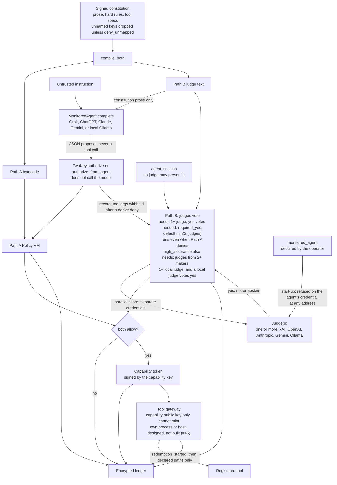
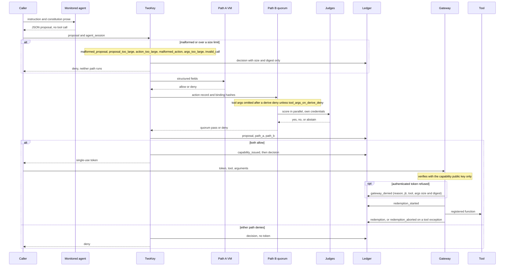

# Two-Key concept

   
   

Two independent keys must turn before an AI agent can act.

This repository is the initial concept, kept small on purpose. It has a
working ledger, Path A, Path B, and the judge and monitored-agent hooks. It does
not scan payloads and it has no antivirus or DLP hooks today. Hooks for
them, and the rest of the path to a 1.0 release, are on the
[roadmap](#roadmap).

Apache License 2.0. See [LICENSE](LICENSE).

Read [docs/FIT.md](docs/FIT.md) first, then
[docs/COMPARISON.md](docs/COMPARISON.md),
[docs/THREAT_MODEL.md](docs/THREAT_MODEL.md), and
[docs/SCOPE.md](docs/SCOPE.md), before relying on it. For where the project
is going, see [ROADMAP.md](ROADMAP.md).

## Components

- **Constitution**: User/admin-configurable set of signed rules (prose, hard rules, and tool specs). The principal signs it; Two-Key enforces the signed form.
- **Policy Enforcer (Path A)**: Deterministic bytecode policy VM. It evaluates structured fields derived from the argument bytes according to the signed tool specs. It does not read free text or English.
- **Judge (Path B)**: Trusted AI agent (local or cloud, preferably suited to the use case). It scores the normalized action record (and optionally the proposal). It has no direct access to any registered tool.
- **Monitored Agent**: The untrusted agent under constraint. It proposes actions; it has no direct access to any registered tool.
- **Tool Gateway**: Accepts a single-use capability token and invokes the registered tool. Intended to run with only the capability public key and a limited ledger role (designed, not yet built — #45).
- **Registered Tool**: The tool protected by the dual-path authorization and the capability token.

## Dual-path authorization

1. Path A is a policy VM. Hard rules compile to bytecode. The VM reads only
   structured fields derived from the argument bytes according to the signed
   tool specs (currently `tool`, `amount_usd`, `data_class`, `counterparty`,
   `irreversible`; the set is intended to be user-configurable at constitution
   signing time — five was the number used for testing only). It does not read
   English. A fault is a deny. The signed
   constitution must include `tool_specs`. Those fields are read from the
   argument bytes by [two_key/derive.py](two_key/derive.py). A claim that
   disagrees with the bytes is a deny. Omitting `tool_specs` will not sign
   and will not load. A key the spec does not name does not reach the tool.
   `deny_unmapped` defaults off, so the call can still be allowed and that
   key is dropped at the gateway. The ledger records the dropped key names
   (`dropped_keys`), never their values. Set it true to deny the key
   instead. A `payload` path names a value that is not interpreted. It may
   not equal, contain, or sit under an amount, currency, or counterparty
   path; such a spec does not load. With no `shape`, it
   covers that value's children. `shape` may lock it to a string, a number,
   or a list of strings. `max_length` bounds a string or a list. Shape does
   not read the contents. The spec does not list every nested key. A counterparty
   path must list `allow`. A party that is not on that list is
   `counterparty_not_allowed`. The tool receives the canonical party, not
   the raw spelling. A value that cannot be read (for example `10**400`) is
   a `derive_failed` deny, and any other exception in `authorize` is an
   `internal_error:` deny, written to the ledger.
2. Path B is a judge quorum. Judges are hooks for xAI/Grok, OpenAI,
   Anthropic, Gemini, and Ollama. The minimum is one judge, and that judge
   must not be the monitored agent: it may run any model from any vendor,
   but never with the agent's credential, at any address. A missing,
   malformed, errored, or
   timed-out ballot does not count as yes. The default policy has no
   diversity floors. `QuorumPolicy.high_assurance()` (or
   `profile: high_assurance` in judges.yaml) needs judges from at least two
   model makers, at least one local judge, and a yes from a local judge; use
   it for destructive, irreversible, financial, or external-send tools. A
   judge's maker is who made its model, as the operator labels it (`maker:`,
   default: its `provider`). It is not verified, and it is a rule about the
   judges only: it is never compared with the monitored agent. `require_local_yes`
   with no local judge does not start. A judge is local only when it says
   so (`local_weights: true`) and its `base_url` host is on an allowlist:
   loopback, RFC 1918, or IPv6 unique-local. A `:cloud`/`-cloud` model is
   never local, for any judge class. With
   `required_yes` unset, the quorum needs `min(2, judges)` yes votes.
   `require_path_a_first` is not a floor and it is not a skip. After a derive
   deny, judges do not receive the argument bytes unless
   `tool_args_on_derive_deny` is set. Path B still runs. Other denies still
   attach non-empty arguments.
3. A short-lived single-use token is issued only if both paths allow. The
   token is signed by a capability key that lives outside the ledger
   directory, not by handing that private key to the gateway. It is bound
   to the tool, the argument hash, the ledger Merkle root at issuance, the
   constitution hashes, `spec_hash`, and the derived form. It lives
   `ttl_seconds` (default 120, at most 300). Redemption writes an intent before the tool
   runs, so a crash cannot run that token twice.
4. The gateway redeems that token with the public half of the capability
   key. It does not hold the minting key, and it does not inspect file
   contents, mail, or tool output for DLP or malware.

Both paths answer once the call is well-formed and within limits. A Path A deny does
not skip Path B, so the ledger has both results. A malformed or oversized
call (`malformed_proposal`, `proposal_too_large`, `action_too_large`,
`malformed_action:`, `args_too_large`, `invalid_call:`) is denied before
either path runs, and only its size and digest are ledgered.
`authorize_from_agent` does not execute the tool. An agent is untrusted whether it is hosted locally or in
the cloud.

## Architecture

A monitored agent and a Path B judge do not call each other, and neither
calls the gateway. The caller runs the agent. Two-Key then runs both paths
once the call is well-formed and within limits.
Only the gateway runs a tool.

```mermaid
flowchart TD
  constitution["Signed constitution<br/>prose, hard rules, tool specs<br/>unnamed keys dropped unless deny_unmapped"] --> compile["compile_both"]
  compile --> bytecode["Path A bytecode"]
  compile --> judgeText["Path B judge text"]
  instruction["Untrusted instruction"] --> agent["MonitoredAgent.complete<br/>Grok, ChatGPT, Claude, Gemini, or local Ollama"]
  judgeText -->|"constitution prose only"| agent
  agent -->|"JSON proposal, never a tool call"| authorize["TwoKey.authorize or authorize_from_agent<br/>does not call the model"]
  bytecode --> pathA["Path A Policy VM"]
  authorize --> pathA
  authorize -->|"record; tool args withheld after a derive deny"| pathB["Path B: judges vote<br/>needs 1+ judge; yes votes needed: required_yes,<br/>default min(2, judges)<br/>runs even when Path A denies<br/>high_assurance also needs: judges from 2+ makers,<br/>1+ local judge, and a local judge votes yes"]
  judgeText --> pathB
  declared["monitored_agent<br/>declared by the operator"] -->|"start-up: refused on the agent's credential,<br/>at any address"| judges
  session["agent_session<br/>no judge may present it"] --> pathB
  pathB -->|"parallel score, separate credentials"| judges["Judge(s)<br/>one or more; xAI, OpenAI, Anthropic, Gemini, Ollama"]
  judges -->|"yes, no, or abstain"| pathB
  pathA --> gate{"both allow?"}
  pathB --> gate
  pathA --> ledger["Encrypted ledger"]
  pathB --> ledger
  gate -->|no| ledger
  gate -->|yes| token["Capability token<br/>signed by the capability key"]
  token --> ledger
  token --> gateway["Tool gateway<br/>capability public key only, cannot mint<br/>own process or host: designed, not built (#45)"]
  gateway -->|"redemption_started, then declared paths only"| tool["Registered tool"]
  gateway --> ledger
```

`MonitoredAgent.complete` sends the constitution prose and the instruction.
It does not receive Path A bytecode, judge credentials, or tool credentials.
Its reply is data: `tool`, `arguments`, `proposal`, and optional structured
fields. Extra keys are rejected. `authorize_from_agent` parses that JSON,
records `agent id`, `hosting`, and `trusted: false`, and does not call the
model again. Those fields are operator/library metadata (str, at most 256
characters after strip); non-str or oversize is a deny. Hosting is local or
cloud. It is not trust, and it does not skip either path.

Path A reads only the structured fields derived from the argument bytes according to the signed tool specs (currently five fields used for testing; the set is intended to be user-configurable at setup/constitution signing time). Path B judges see the
normalized action record. Non-empty tool arguments are attached on that
record as `tool_args`, except after a derive deny. Set
`tool_args_on_derive_deny: true` on the quorum policy to send those bytes
anyway. Path B still runs either way. A rule deny that is not a derive deny
still attaches the arguments. The proposal string is not sent unless that
judge has `receives_proposal: true`, or the quorum policy is
`judge_inputs: record_and_proposal`. The code default, and
`examples/judges.yaml`, is `record_only`.

Judges are loaded into `TwoKey` from their own config and their own API
keys. The operator declares the monitored agent (`monitored_agent:` in
judges.yaml, or `TwoKey(monitored_agent=...)`): its model, `base_url`, and
credential. The agent's own report is never used. At start-up `TwoKey`
resolves every judge and the agent to a normalized model (Unicode forms
and dashes folded), the endpoint `host:port`, the upstream that serves it
and how that was found (`resolved_by`: `endpoint`, `model_prefix`, or
`declared_upstream`), scoped tenant ids (a `tenant:` mapping of
`organization`, `project`, `account`, or `deployment`, plus what the URL
shows), and a credential fingerprint under a per-install key, whitespace
stripped (HMAC-SHA256 for an API token; PBKDF2-HMAC-SHA256, 600,000
iterations, for a username and password, fingerprinted as one pair, and for
any secret that contains `:`). Every credential a side holds is fingerprinted, sent or not.

A judge may run any model from any vendor. A judge is not the monitored agent, and
`TwoKey` refuses to start (`judge_matches_agent:`), when it holds the monitored
agent's credential (the same API token, or the same username and password),
at any address: a credential identifies its holder wherever it is sent. Two
sides that send no credential are the same agent only on the same address (the
endpoint `host:port`, every alias of this machine folded to `localhost`),
where nothing tells them apart. Everything else starts. Likely accidents
are allowed with a `two-key: WARNING:` line on stderr and recorded in
`constitution_loaded` (`judge_agent_separation.warnings`): the same model
on the same address, the same model through a shared route or a local or
unrecognized proxy with no declared `upstream:`, a shared tenant id, one
side keyless on the same address, and an identity whose upstream cannot be
resolved. Addresses are compared as configured; DNS names are not
resolved. A username and password are sent as HTTP Basic over HTTPS only.
`allow_same_provider_judge` and `allow_same_model_distinct_tenant` are
accepted and have no effect. Without a declaration it refuses with
`monitored_agent_required:`. Provider labels are never compared. HOWTO has
the details.

Judges vote in parallel under one hard deadline. A missing, malformed, or
timed-out ballot is an abstention, and an abstention is not a yes. No
judge, no deadline, or two judges with the same id does not start. Each
ballot is paired with its judge by position and takes its judge id from
the judge; a ballot that names another judge abstains
(`judge_id_mismatch`). A judge
that is not on a loopback host makes the round deny when `agent_session`
is missing. If that string equals the credential of any judge, local or
cloud, wherever it connects, the ballot abstains with
`cloud_judge_reused_agent_session` and the round denies. The credential
named for the monitored agent is compared the same way on every call, so a
placeholder does not hide that key. The key is not sent to the judge and
not written to the ledger. A session that is not that key is still yours
to pass. `X-Two-Key-Judge-Session` is a call id minted here. It is not a
session at the model host.

Without a local judge, the constitution prose, the action record, and any
attached tool arguments go to the cloud judges' vendors.

Every `decision` in the ledger records `policy_digest`, the digest of the
quorum policy in effect (opt-outs included, written in full once in
`constitution_loaded`), and `identities_digest`, the digest of the resolved
judge and agent identities written once in `constitution_loaded`: model,
upstream, endpoint, tenant ids, and credential fingerprint, never a key.

Every JSON and YAML input is parsed strictly: a repeated key at any depth
is refused, never last-one-wins, and so is a YAML merge key (`<<`), whose
winning value the text does not show. An integer of more than 4,300 digits
is refused or denied as `invalid_call`. Unknown top-level keys in judges.yaml or
agents.yaml are refused. Tool arguments or a proposal over 256 KiB, or
tool arguments, the action claim, or a structured proposal nested more than
62 levels, are denied before they are ledgered.

One call, in code order:

```mermaid
sequenceDiagram
  participant Caller
  participant Agent as Monitored agent
  participant TwoKey
  participant PathA as Path A VM
  participant PathB as Path B quorum
  participant Judge as Judges
  participant Ledger
  participant Gateway
  participant Tool

  Caller->>Agent: instruction and constitution prose
  Agent-->>Caller: JSON proposal, no tool call
  Caller->>TwoKey: proposal and agent_session
  alt malformed or over a size limit
    Note over TwoKey: malformed_proposal, proposal_too_large, action_too_large, malformed_action, args_too_large, invalid_call
    TwoKey->>Ledger: decision with size and digest only
    TwoKey-->>Caller: deny, neither path runs
  end
  TwoKey->>PathA: structured fields
  PathA-->>TwoKey: allow or deny
  TwoKey->>PathB: action record and binding hashes
  Note over PathB: tool args omitted after a derive deny unless tool_args_on_derive_deny
  PathB->>Judge: score in parallel, own credentials
  Judge-->>PathB: yes, no, or abstain
  PathB-->>TwoKey: quorum pass or deny
  TwoKey->>Ledger: proposal, path_a, path_b
  alt both allow
    TwoKey->>Ledger: capability_issued, then decision
    TwoKey-->>Caller: single-use token
    Caller->>Gateway: token, tool, arguments
    Note over Gateway: verifies with the capability public key only
    opt authenticated token refused
      Gateway->>Ledger: gateway_denied (reason, jti, tool, args size and digest)
    end
    Gateway->>Ledger: redemption_started
    Gateway->>Tool: registered function
    Gateway->>Ledger: redemption, or redemption_aborted on a tool exception
  else either path denies
    TwoKey->>Ledger: decision, no token
    TwoKey-->>Caller: deny
  end
```

The token is signed by the capability key (`<ledger>.capability/capability.pem`,
outside the ledger directory). It is bound to the tool, the argument hash,
the ledger Merkle root and size at issuance, the constitution hashes,
`spec_hash`, and the derived form. The gateway is constructed with
`issuer.verifier()` or with the issuer; either way it keeps only the public
half of the capability key. It recomputes the form from the same bytes. It checks the
signature, expiry, a lifetime no longer than the TTL (`ttl_too_long`), an
issue time at most 5 s ahead (`issued_in_future`), and that nothing revoked
or reloaded the constitution after issuance. It writes `redemption_started` before the tool runs. It does not
scan the bytes for sensitive text. The principal key still signs the
constitution and the ledger head. A token signed with that principal key
does not redeem, and a capability key equal to the principal key is
refused. The capability key is created once, mode 0600 in a 0700
directory, and, like the witness key, is read only as a regular file that
the group and others cannot read, never through a symlink. Once a token has been issued it is never regenerated: a missing
or changed key refuses to start. Its fingerprint is recorded in
`constitution_loaded` and the gateway checks it.

The gateway is meant to run in its own process or on its own host, holding
the capability public key and a gateway-only ledger role: it reads the
ledger, refreshes without ending outstanding tokens, and records
redemptions, without the principal or witness private key. That role is
designed, not yet built
([#45](https://github.com/Insomniac-VibeLabs/two-key-concept/issues/45)).
Today the gateway shares the ledger object of the `TwoKey` process, and
that object holds the principal, witness, and ledger keys.

## What this repo leaves out

Not in this repository:

- payload scanning, antivirus, and DLP hooks
- enterprise deployment modes and permissioned-chain anchoring
- X.509 / PKI identities and agent assertions
- seed-phrase backup
- hybrid ML-DSA-65

Some of this is planned as optional additions. See the
[roadmap](#roadmap): DLP and antivirus hooks (an interface that calls
external scanners, not a scanning engine), PKI with certificate recovery,
and hybrid ML-DSA-65. Key backup shipped in 0.3.0 and is not seed-phrase
backup. Enterprise deployment modes, permissioned-chain anchoring, and seed
phrases are not planned.

The ledger is encrypted at rest.

Crypto here is Ed25519 and SHA-256 via the `cryptography` package. Ledger
entries and the signed head are AES-256-GCM at rest. The data key is wrapped
by a ledger key outside the ledger directory, not by the principal key. The
head is signed by the principal and by a witness key, also outside the ledger
directory. A stolen principal key alone cannot decrypt the log or sign a new
head. The witness public key is pinned in the ledger (the first entry,
`witness_pinned`), so a replaced `witness.pem` is refused
(`witness_key_changed`). With the ledger key as well, the principal key can
still rewrite the chain from its first entry, pin included, unless the
operator also gives the witness public key as configuration
(`Ledger(..., witness_public_key=...)` or `--witness-public-key`), kept
where whoever writes the ledger directory cannot change it. With that pin,
forging a head needs the principal, witness, and ledger keys together. The
witness key changes only by a ledgered rotation (`two-key rotate-witness`).
It is a prototype. It is not a FIPS 140-3 validated module.

## Known limits

- Path A structured fields are currently a fixed set used for testing (`tool`, `amount_usd`, `data_class`, `counterparty`, `irreversible`). The intent is that the set is user-configurable at constitution signing time; that configurability is not yet implemented (see open issue).
- No independent review and no production deployment.
- No external anchor for the ledger. Someone holding the principal and
  ledger keys can rewrite a ledger that never leaves the machine, unless
  the witness public key is configured outside the ledger
  (`--witness-public-key`); then the witness key is needed too (#58).
  A head a